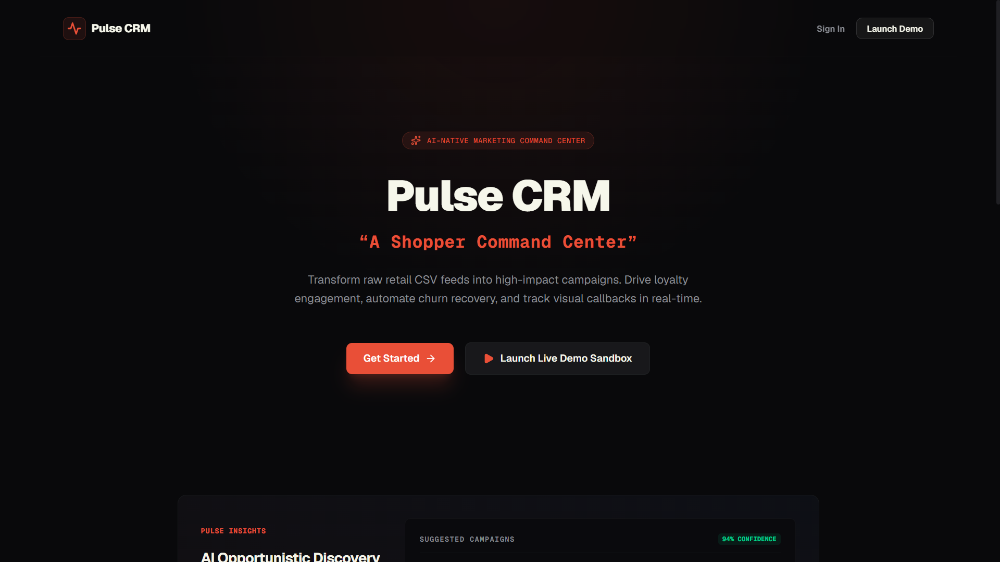
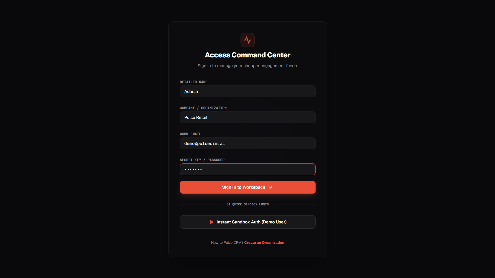
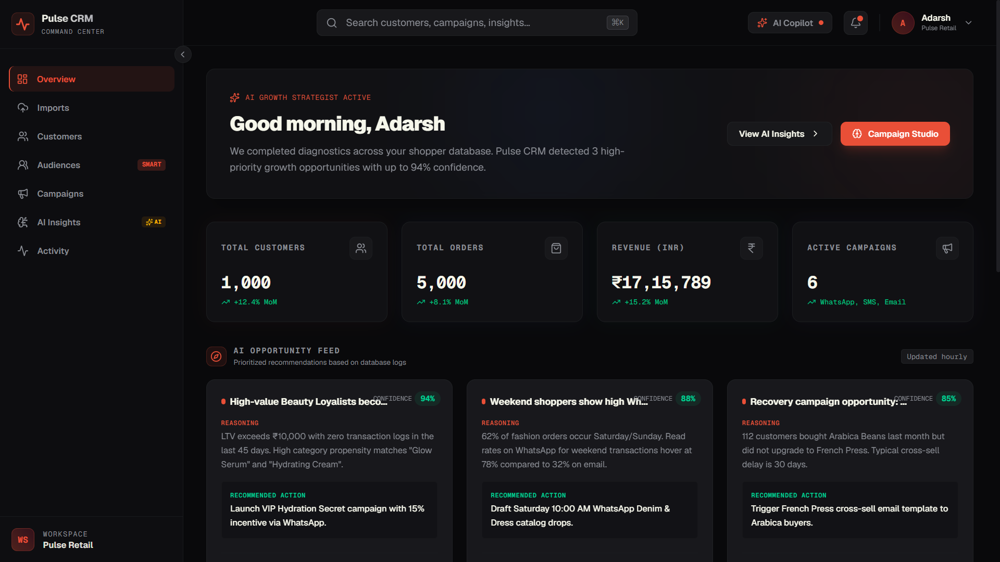
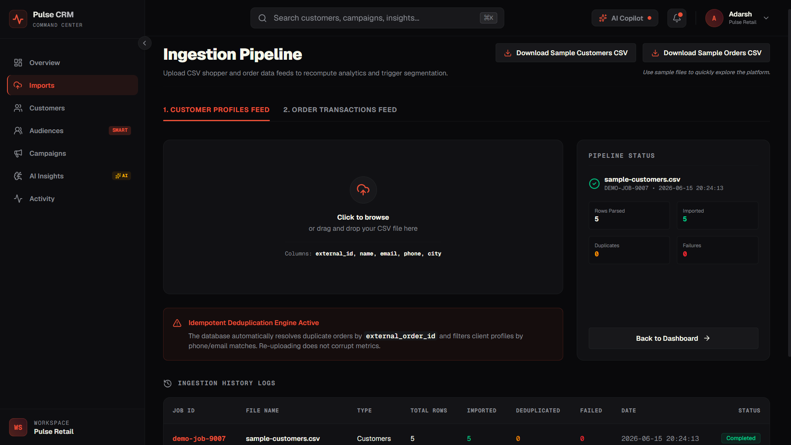
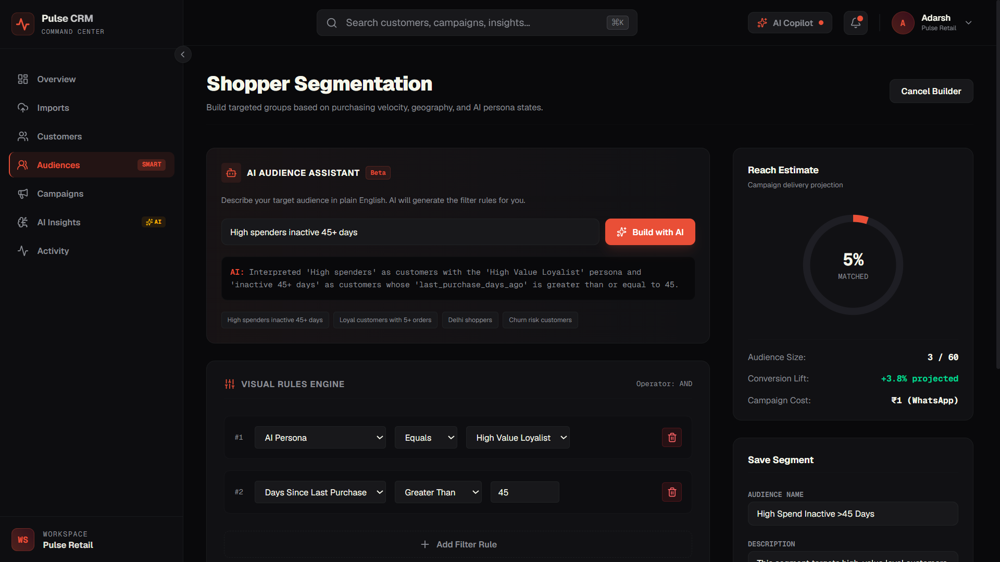
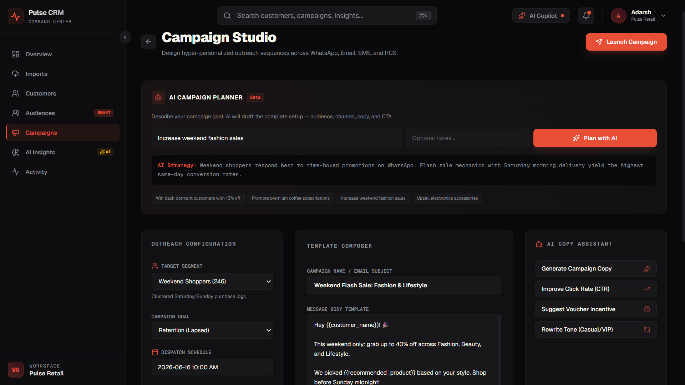
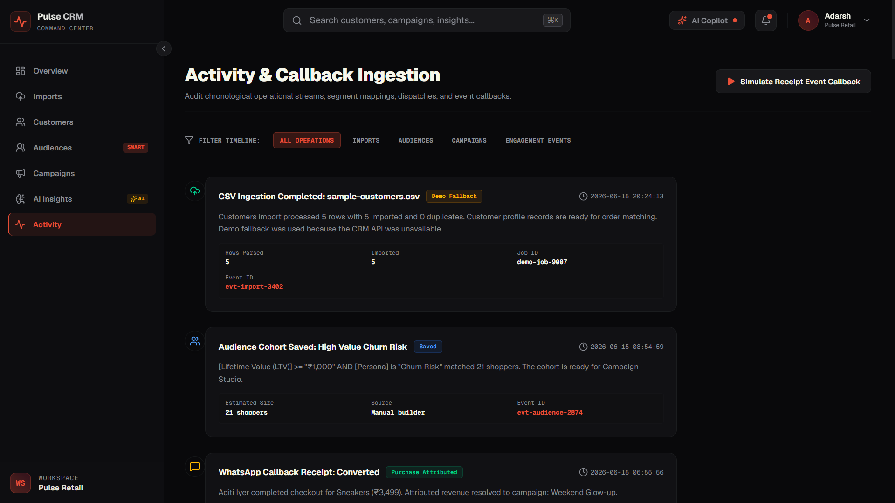
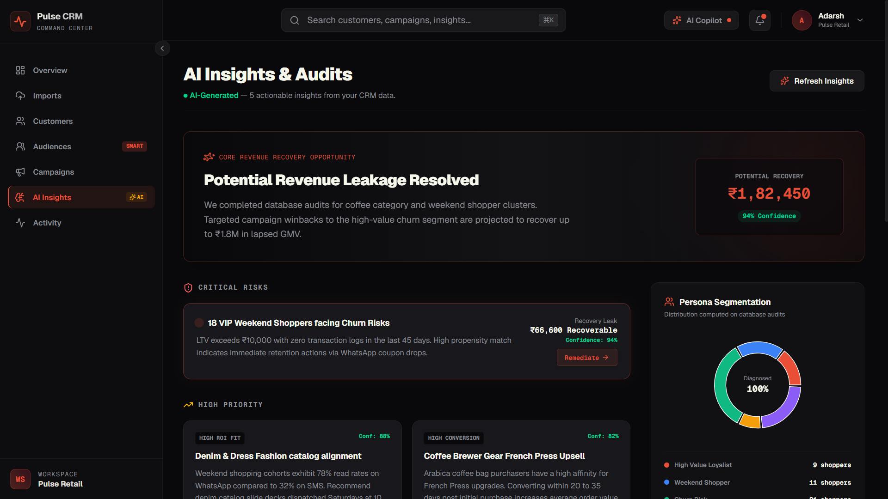

# Pulse CRM — A Shopper Command Center

> An AI-native marketing CRM platform for shopper engagement, audience segmentation, campaign orchestration, and communication tracking.

## Live Demo

### Frontend

https://pulse-crm-persistent-amd.vercel.app/

### Backend API Docs

https://pulse-crm-6p6n.onrender.com/docs

---

Use the Instant Sandbox for quick viewing/testing
---
## Demo Credentials

Use the built-in demo account:

Email: [demo@pulsecrm.ai](mailto:demo@pulsecrm.ai)
Password: demo123

Or create a new account using the Sign Up page.

---

## Key Features

### AI-Native Audience Builder

Describe an audience in natural language and AI converts it into structured segmentation rules.

Example:
"Customers who spent over ₹10,000 and haven't purchased in 45 days"

### AI Campaign Planner

Describe a marketing goal and AI generates:

* Campaign name
* Audience recommendation
* Channel recommendation
* Message copy
* CTA
* Campaign rationale

Example:
"Reactivate inactive customers with a 15% discount"

### AI Copilot

Chat-based marketing assistant for:

* Campaign ideation
* Audience discovery
* Retention strategies
* Growth recommendations

### Callback-Driven Channel Simulation

Campaigns are dispatched through a separate Channel Service which simulates:

* Sent
* Delivered
* Failed
* Opened / Read
* Clicked
* Converted

Events are asynchronously sent back to the CRM through receipt callbacks and reflected in analytics.

---

## Design Decisions & Tradeoffs

### Why a Separate Channel Service?

Real messaging providers operate outside the CRM.

Instead of updating campaign status directly, Pulse CRM uses a dedicated channel service that:

CRM → Channel Service → Callback Events → CRM

This models real-world webhook-based communication platforms.

### Why AI-Assisted Instead of Fully Autonomous?

The goal was to keep marketers in control.

AI helps with:

* Audience creation
* Campaign planning
* Marketing insights

while allowing human review before launch.

### Scale Assumptions

Current implementation is optimized for assignment scope.

At larger scale I would introduce:

* Redis/Kafka/SQS for event processing
* Worker queues for imports
* Async campaign dispatch workers
* Distributed callback processing
* Observability and monitoring
* Rate limiting and throttling

---

## Architecture

```
┌─────────────────────┐    ┌──────────────────────┐    ┌─────────────┐
│  Next.js Frontend   │───▶│  FastAPI Backend      │───▶│ PostgreSQL  │
│  (React, Tailwind)  │    │  (Python, SQLAlchemy) │    │             │
│  Port 3000          │    │  Port 8000            │    │  Port 5432  │
└─────────────────────┘    └──────────────────────┘    └─────────────┘
         │                          │
         ▼                          ▼
   ┌──────────┐            ┌─────────────────┐
   │ Gemini AI│            │ Channel Service │
   │ (opt.)   │            │ (opt. Port 9000)│
   └──────────┘            └─────────────────┘
```

Customer CSV
      ↓
PostgreSQL
      ↓
Audience Builder
      ↓
AI Campaign Planner
      ↓
Campaign Launch
      ↓
Channel Service
      ↓
Receipt Callbacks
      ↓
Analytics & Insights

## Product Screenshots

### 1. Landing Page

The public-facing entry point of Pulse CRM. Introduces the platform as an AI-native shopper command center and highlights the core value proposition.



---

### 2. Authentication & Workspace Access

A lightweight authentication experience with demo sandbox access for quickly exploring the platform.



---

### 3. Executive Dashboard

A unified command center showing customer growth, revenue metrics, campaign performance, and AI-generated growth opportunities.



---

### 4. Customer & Order Ingestion Pipeline

Upload customer and order CSV feeds, validate records, deduplicate data, and monitor ingestion status.

**Assignment Requirement Covered:** Customer & Order Data Ingestion



---

### 5. AI Audience Builder

Create audience segments using natural language. The AI Audience Assistant converts marketer intent into actionable segmentation rules.

**Example:**  
*"High spenders inactive for 45+ days"* → Automatically generates audience filters.

**Assignment Requirement Covered:** Shopper Segmentation



---

### 6. AI Campaign Studio

Generate campaign strategy, target audience recommendations, communication channels, and personalized campaign copy from a business goal.

**Example:**  
*"Increase weekend fashion sales"* → AI drafts a complete campaign setup.

**Assignment Requirement Covered:** Personalized Communication



---

### 7. Communication Lifecycle & Callback Tracking

Activity timeline displaying campaign dispatches, delivery events, engagement callbacks, and purchase attribution events received from the simulated channel service.

**Assignment Requirement Covered:** Communication Performance Tracking



---

### 8. AI Insights Engine

AI-generated business recommendations, churn risk detection, revenue recovery opportunities, persona analysis, and campaign suggestions derived from shopper behavior.



---

## Quick Start

### Prerequisites

- Node.js 18+
- Python 3.11+
- PostgreSQL 15+

### 1. Clone and Setup

```bash
git clone <repo-url>
cd pulse-crm
```

### 2. Backend

```bash
cd backend
cp .env.example .env        # Edit DATABASE_URL
pip install -r requirements.txt
alembic upgrade head         # Run migrations
uvicorn app.main:app --reload --port 8000
```

Verify: `http://localhost:8000/health` → `{"status": "ok"}`

### 3. Frontend

```bash
cd frontend
cp .env.example .env.local   # Optionally add GOOGLE_API_KEY
npm install
npm run dev                   # Starts on http://localhost:3000
```

### 4. Demo Mode (No Backend Required)

The frontend works fully without a backend. All pages use graceful fallbacks:

| Feature | With Backend | Without Backend |
|---------|-------------|-----------------|
| Customer Import | Real PostgreSQL insert | Simulated with counters |
| Customer List | Live from DB | Mock data (60 customers) |
| Audience Builder | Real preview/save | Client-side filtering |
| Dashboard KPIs | Live counts | Static mock values |
| Campaign Launch | Persisted to localStorage | Persisted to localStorage |
| Activity Feed | Persisted to localStorage | Persisted to localStorage |
| AI Copilot | Gemini API (if key set) | Intelligent mock responses |
| AI Insights | Gemini API (if key set) | Curated mock insights |
| Campaign AI | Gemini API (if key set) | Template-based suggestions |

---

## Gemini AI Setup (Optional)

1. Get an API key from [Google AI Studio](https://aistudio.google.com/apikey)
2. Add to `frontend/.env.local`:
   ```
   GOOGLE_API_KEY=your_key_here
   ```
3. Restart the Next.js dev server

When the key is not set, all AI features use the `MockAiProvider` which returns high-quality pre-written responses.

---

## End-to-End Demo Walkthrough

1. **Landing Page** → Click "Get Started" or "View Demo"
2. **Login** → Use demo credentials or sign up
3. **Dashboard** → View KPIs, persona breakdown, revenue trend
4. **Imports** → Download sample CSV → Upload it → View import results
5. **Customers** → Browse imported customer profiles
6. **Audiences** → Create audience with filter rules → Preview → Save
7. **Campaign Studio** → Select audience → Use AI to generate copy → Launch
8. **Campaign Hub** → View launched campaign status
9. **Activity** → See campaign dispatch event → Simulate receipt callback
10. **AI Insights** → View AI-generated marketing recommendations

---

## Project Structure

```
pulse-crm/
├── backend/
│   ├── app/
│   │   ├── api/routes/        # FastAPI endpoints
│   │   ├── models/            # SQLAlchemy models
│   │   ├── schemas/           # Pydantic schemas
│   │   ├── services/          # Business logic
│   │   └── main.py            # App factory
│   └── alembic/               # Database migrations
├── frontend/
│   ├── src/
│   │   ├── app/               # Next.js App Router pages
│   │   │   ├── api/ai/        # Server-side AI API routes
│   │   │   └── app/           # Dashboard pages
│   │   ├── components/        # Shared UI components
│   │   ├── lib/               # Business logic
│   │   │   ├── ai/            # AI provider abstraction
│   │   │   ├── api.ts         # Backend API client
│   │   │   ├── demo-state.ts  # localStorage persistence
│   │   │   └── sample-data.ts # CSV schemas & validation
│   │   └── utils/             # Mock data generators
│   └── .env.example
├── channel-service/           # Delivery simulation service
└── docs/                      # PRD, sample CSVs
```

---

## Environment Variables

### Frontend (`frontend/.env.local`)

| Variable | Required | Description |
|----------|----------|-------------|
| `GOOGLE_API_KEY` | No | Gemini API key for AI features |
| `NEXT_PUBLIC_API_URL` | No | Backend URL (default: `http://127.0.0.1:8000`) |

### Backend (`backend/.env`)

| Variable | Required | Description |
|----------|----------|-------------|
| `DATABASE_URL` | Yes | PostgreSQL connection string |
| `APP_NAME` | No | Application name |
| `DEBUG` | No | Debug mode (default: `true`) |
| `CORS_ORIGINS` | No | Allowed origins (default: `["http://localhost:3000"]`) |

---

## API Endpoints

| Method | Path | Description |
|--------|------|-------------|
| `GET` | `/health` | Health check |
| `POST` | `/imports/customers` | Upload customer CSV |
| `POST` | `/imports/orders` | Upload order CSV |
| `GET` | `/audiences` | List saved audiences |
| `POST` | `/audiences` | Save audience |
| `POST` | `/audiences/preview` | Preview audience size |
| `POST` | `/receipt` | Ingest delivery receipt |
| `GET` | `/debug/summary` | KPI summary |
| `GET` | `/debug/customers` | Customer list |
| `GET` | `/sample/customers.csv` | Download sample CSV |
| `GET` | `/sample/orders.csv` | Download sample CSV |

---

## Tech Stack

- **Frontend**: Next.js 16, React, TypeScript, Tailwind CSS, shadcn/ui, Recharts
- **Backend**: FastAPI, SQLAlchemy, PostgreSQL, Alembic
- **AI**: Google Gemini 2.5 Flash (optional)
- **Design**: Dark mode first, premium SaaS aesthetics

---

## Assignment Coverage

| Requirement | Status |
|------------|--------|
| Customer & Order Ingestion | ✅ |
| Shopper Segmentation | ✅ |
| Personalized Campaigns | ✅ |
| Communication Performance Tracking | ✅ |
| AI Audience Builder | ✅ |
| AI Campaign Planner | ✅ |
| AI Copilot Assistant | ✅ |
| AI Insights Engine | ✅ |
| Separate Channel Service | ✅ |
| Callback Receipt Processing | ✅ |
| Delivery Event Simulation | ✅ |
| Conversion Attribution | ✅ |


## License

MIT
