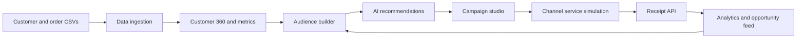
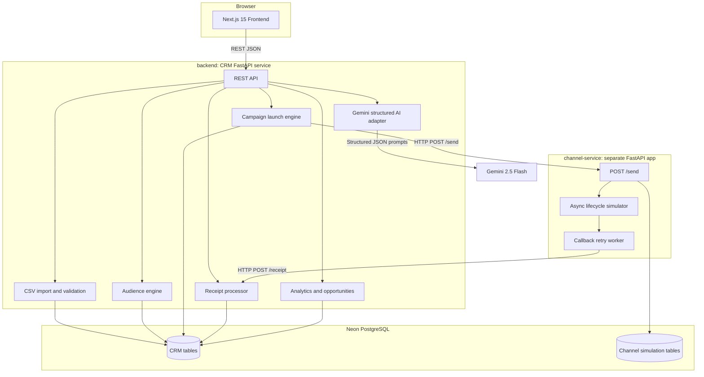
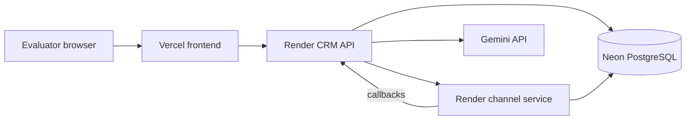
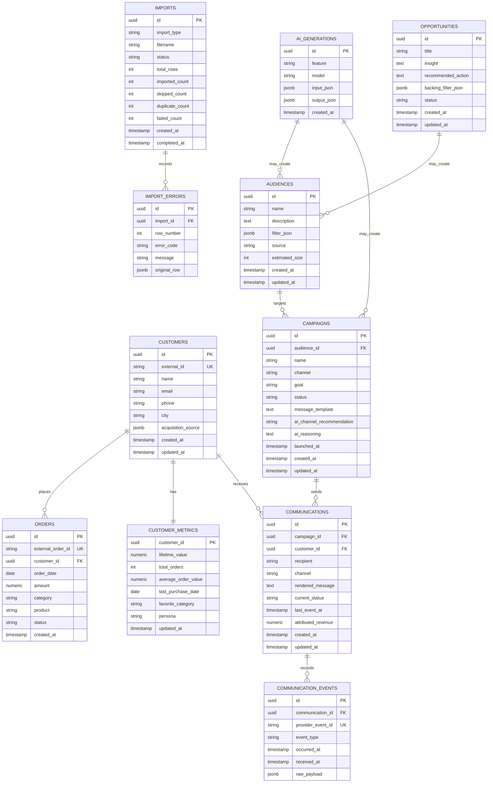
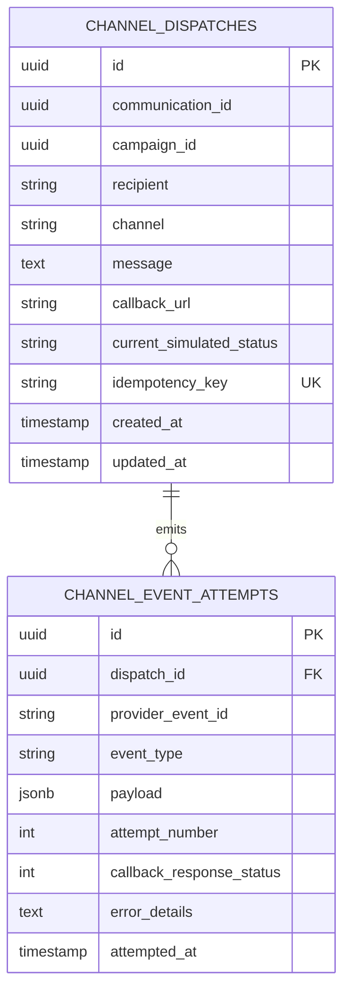

# Pulse CRM Architecture

Pulse CRM is an AI-native shopper engagement command center for retail and D2C marketers. It helps a marketer ingest customer/order data, discover audiences, generate campaigns, simulate omnichannel delivery, and analyze communication performance.

This document is the implementation blueprint for the assignment build. It follows the PRD and keeps the system intentionally scoped: shopper engagement, not sales CRM, support CRM, loyalty marketplace, rewards, referrals, or lead management.

## 1. System Architecture

### Product Workflow



### Application Topology



### Services

| Component | Stack | Responsibility |
| --- | --- | --- |
| `frontend` | Next.js 15, TypeScript, Tailwind CSS, shadcn/ui, Recharts | Desktop-first marketer interface: dashboard, imports, customers, audiences, campaigns, analytics. |
| `backend` | FastAPI, SQLAlchemy, Alembic, Pydantic | CRM system of record, CSV import, audience queries, AI orchestration, campaign launch, receipt ingestion, analytics. |
| `channel-service` | FastAPI | Separate stubbed provider. Accepts outbound messages, simulates delivery/engagement lifecycle, and calls CRM receipts asynchronously. |
| PostgreSQL | Neon | Primary relational data store. For demo simplicity, use one database with CRM-owned tables and channel-service-owned tables. |
| Gemini | Gemini 2.5 Flash | Structured JSON audience generation and campaign copy generation. No agents, no RAG, no vector database. |

### Deployment Shape



Recommended environment variables:

| App | Variable | Purpose |
| --- | --- | --- |
| `frontend` | `NEXT_PUBLIC_API_URL` | CRM API base URL. |
| `backend` | `DATABASE_URL` | PostgreSQL connection string. |
| `backend` | `GEMINI_API_KEY` | Gemini structured generation. |
| `backend` | `CHANNEL_SERVICE_URL` | Channel service base URL. |
| `backend` | `CRM_PUBLIC_BASE_URL` | Public callback base URL used in `/send` payloads. |
| `channel-service` | `DATABASE_URL` | Same database or separate database connection. |
| `channel-service` | `CRM_RECEIPT_URL` | Fallback callback URL for local/dev flows. |
| `channel-service` | `SIMULATION_SEED` | Optional deterministic demo runs. |

## 2. Domain Model and Database Schema

Use PostgreSQL with UUID primary keys, `created_at`, and `updated_at` timestamps on mutable tables. Store money as integer paise/cents or `NUMERIC(12,2)` consistently; `NUMERIC(12,2)` is simpler for this demo.

### CRM-Owned Tables



#### Table Notes

| Table | Implementation notes |
| --- | --- |
| `customers` | Deduplicate primarily by `external_id`, then fallback to normalized email/phone if imported data lacks IDs. |
| `orders` | Deduplicate by `external_order_id`. Order imports should recompute `customer_metrics`. |
| `customer_metrics` | Materialized metrics for fast dashboards and audience previews. Recompute after imports and optionally after attributed conversions. |
| `imports` / `import_errors` | Power import summary cards and downloadable error CSV. |
| `audiences` | `filter_json` is the canonical audience definition. Manual and AI audiences use the same schema. |
| `campaigns` | Draft, launched, completed, and failed statuses are enough for the demo. |
| `communications` | One row per campaign recipient. This is the source for campaign performance metrics. |
| `communication_events` | Append-only event log. Unique `provider_event_id` makes receipt ingestion idempotent. |
| `ai_generations` | Stores structured AI inputs and outputs for explainability during interview/code walkthrough. |
| `opportunities` | Optional persisted cards. A deterministic computed endpoint is acceptable for v1 if time is tight. |

### Channel-Service-Owned Tables



The channel service owns simulation state only. It must never write CRM communication statuses directly.

### Audience Filter JSON

Use one shared filter format for manual audiences, AI-generated audiences, opportunity actions, and preview endpoints:

```json
{
  "operator": "and",
  "conditions": [
    { "field": "lifetime_value", "op": "gt", "value": 5000 },
    { "field": "last_purchase_days_ago", "op": "gt", "value": 45 },
    { "field": "persona", "op": "eq", "value": "Churn Risk" }
  ]
}
```

Supported fields for v1:

| Field | Source | Operators |
| --- | --- | --- |
| `lifetime_value` | `customer_metrics.lifetime_value` | `gt`, `gte`, `lt`, `lte`, `between` |
| `total_orders` | `customer_metrics.total_orders` | `gt`, `gte`, `lt`, `lte`, `between` |
| `last_purchase_days_ago` | Derived from `customer_metrics.last_purchase_date` | `gt`, `gte`, `lt`, `lte`, `between` |
| `city` | `customers.city` | `eq`, `in` |
| `persona` | `customer_metrics.persona` | `eq`, `in` |

Reject unsupported fields/operators instead of attempting best-effort SQL generation.

### Persona Rules

Personas are deterministic and explainable:

| Persona | Rule |
| --- | --- |
| `High Value Loyalist` | Lifetime value >= 10000 and total orders >= 5. |
| `Weekend Shopper` | Majority of orders occurred on Saturday/Sunday. |
| `Discount Hunter` | Favorite category or imported tags indicate discount-heavy behavior, or average order value is low with high frequency. |
| `Churn Risk` | Last purchase more than 60 days ago and total orders >= 2. |
| `New Customer` | First order within the last 30 days. |

When multiple rules match, priority order is: `Churn Risk`, `High Value Loyalist`, `Weekend Shopper`, `Discount Hunter`, `New Customer`.

## 3. API Design

All CRM responses should be JSON except downloadable import error reports. Use Pydantic request/response models and return stable error codes for validation failures.

### CRM Backend API

#### Health

| Method | Path | Purpose |
| --- | --- | --- |
| `GET` | `/health` | Service and database health check. |

#### Imports

| Method | Path | Purpose |
| --- | --- | --- |
| `POST` | `/imports/customers` | Upload `customers.csv`, validate rows, deduplicate, store import summary. |
| `POST` | `/imports/orders` | Upload `orders.csv`, validate rows, deduplicate, store orders, recompute metrics. |
| `GET` | `/imports/{id}` | Read import status and counts. |
| `GET` | `/imports/{id}/errors.csv` | Download row-level error report. |

Customer CSV minimum columns:

```text
external_id,name,email,phone,city
```

Order CSV minimum columns:

```text
external_order_id,customer_external_id,order_date,amount,category,product,status
```

#### Customers

| Method | Path | Purpose |
| --- | --- | --- |
| `GET` | `/customers` | Paginated customer list with search, city/persona filters, and metric summary. |
| `GET` | `/customers/{id}` | Customer 360 profile, metrics, and recent orders. |
| `GET` | `/customers/{id}/timeline` | Combined order, campaign, and communication event timeline. |

#### Audiences

| Method | Path | Purpose |
| --- | --- | --- |
| `POST` | `/audiences/preview` | Validate filter JSON and return audience size plus sample customers. |
| `POST` | `/audiences` | Save a named audience. |
| `GET` | `/audiences` | List saved audiences with estimated size. |
| `GET` | `/audiences/{id}` | Audience definition, size, and matching customer preview. |

#### AI

| Method | Path | Purpose |
| --- | --- | --- |
| `POST` | `/ai/audiences/generate` | Convert natural language marketer intent into validated audience filter JSON. |
| `POST` | `/ai/campaigns/generate` | Generate campaign name, message template, channel recommendation, and reasoning. |

`POST /ai/audiences/generate` response shape:

```json
{
  "generation_id": "uuid",
  "filter_json": {
    "operator": "and",
    "conditions": [
      { "field": "lifetime_value", "op": "gt", "value": 5000 }
    ]
  },
  "human_readable_logic": "Customers with lifetime value above 5000",
  "estimated_size": 214,
  "requires_approval": true
}
```

`POST /ai/campaigns/generate` response shape:

```json
{
  "generation_id": "uuid",
  "campaign_name": "Win Back High-Value Shoppers",
  "message_template": "Hi {{customer_name}}, we saved something special for you...",
  "channel_recommendation": "WhatsApp",
  "reasoning": "This audience has high purchase history and recent inactivity, so a direct high-intent channel is appropriate.",
  "requires_approval": true
}
```

#### Campaigns

| Method | Path | Purpose |
| --- | --- | --- |
| `POST` | `/campaigns` | Create draft campaign from selected audience, channel, goal, and template. |
| `GET` | `/campaigns` | List campaigns with status and key metrics. |
| `GET` | `/campaigns/{id}` | Campaign details, template, audience, and communication summary. |
| `POST` | `/campaigns/{id}/launch` | Render messages for audience members, create communications, call channel service. |
| `GET` | `/campaigns/{id}/analytics` | Delivery, engagement, conversion, and revenue attribution metrics. |

Launch behavior:

1. Resolve the saved audience to customer IDs.
2. Render dynamic variables in the message template for each customer.
3. Create one `communications` row per customer.
4. Call `channel-service POST /send` with an idempotency key per communication.
5. Mark campaign `launched` once dispatch requests are accepted.

Supported dynamic variables:

| Variable | Source |
| --- | --- |
| `{{customer_name}}` | `customers.name` |
| `{{favorite_category}}` | `customer_metrics.favorite_category` |
| `{{last_purchase_date}}` | `customer_metrics.last_purchase_date` |
| `{{recommended_product}}` | Simple rule based on favorite category and seed catalog. |

#### Receipt API

| Method | Path | Purpose |
| --- | --- | --- |
| `POST` | `/receipt` | Receive channel lifecycle callbacks and update communication event timeline. |

Request shape:

```json
{
  "provider_event_id": "channel-evt-uuid",
  "communication_id": "uuid",
  "campaign_id": "uuid",
  "channel": "WhatsApp",
  "event_type": "delivered",
  "occurred_at": "2026-06-14T10:30:00Z",
  "metadata": {
    "attempt": 1,
    "simulated": true
  }
}
```

Receipt rules:

| Rule | Behavior |
| --- | --- |
| Deduplication | If `provider_event_id` already exists, return `200 OK` with `duplicate: true` and do not create another event. |
| Event history | Store every non-duplicate callback in `communication_events`, even if it does not advance `communications.current_status`. |
| Out-of-order handling | Use lifecycle rank. Lower-ranked late events do not regress current status. |
| Failed handling | `failed` is terminal only if no successful delivery or engagement state has already been recorded. |
| Unknown communication | Return `404` for invalid `communication_id`; channel service will record the failed callback attempt. |
| Retry safety | Endpoint must be safe for repeated callbacks with the same provider event ID. |

Lifecycle rank:

| Event | Rank |
| --- | --- |
| `queued` | 0 |
| `sent` | 10 |
| `failed` | 15 |
| `delivered` | 20 |
| `opened` | 30 |
| `read` | 40 |
| `clicked` | 50 |
| `converted` | 60 |

`converted` can add `attributed_revenue` when metadata contains an order amount or simulated conversion value.

#### Dashboard and Analytics

| Method | Path | Purpose |
| --- | --- | --- |
| `GET` | `/dashboard/summary` | Top KPI cards: customers, orders, revenue, campaigns, messages sent, conversion rate. |
| `GET` | `/opportunities` | AI-style opportunity cards with recommended actions. |
| `GET` | `/analytics/campaigns` | Campaign performance table and trend data. |
| `GET` | `/analytics/channels` | Channel-level delivery/read/click/conversion metrics. |
| `GET` | `/analytics/audiences` | Audience-level campaign and revenue performance. |

Opportunity cards can be deterministic in v1:

| Opportunity | Backing logic |
| --- | --- |
| `Customers have not purchased in 60 days` | Count customers where `last_purchase_date < today - 60 days`. |
| `Weekend shoppers respond better to WhatsApp` | Compare read/click rates for `Weekend Shopper` persona by channel. |
| `High-value customers show churn signals` | Lifetime value >= 10000 and last purchase > 45 days ago. |

### Channel Service API

The channel service is a separate app with its own FastAPI entrypoint and database models.

| Method | Path | Purpose |
| --- | --- | --- |
| `GET` | `/health` | Service and database health check. |
| `POST` | `/send` | Accept one simulated outbound communication. |
| `GET` | `/dispatches/{communication_id}` | Debug/demo visibility into simulated lifecycle attempts. |
| `POST` | `/dev/dispatches/{communication_id}/emit` | Optional dev-only endpoint to manually emit an event during demos. |

`POST /send` request:

```json
{
  "communication_id": "uuid",
  "campaign_id": "uuid",
  "recipient": "+919999999999",
  "channel": "WhatsApp",
  "message": "Hi Asha, your coffee picks are waiting.",
  "callback_url": "https://api.example.com/receipt",
  "idempotency_key": "campaign-id:communication-id"
}
```

`POST /send` behavior:

1. Upsert or return the existing dispatch by `idempotency_key`.
2. Store dispatch payload in `channel_dispatches`.
3. Schedule async lifecycle simulation.
4. Return `202 Accepted` with dispatch status.

Simulation probabilities should be realistic but simple:

| Channel | Sent | Delivered | Opened/Read | Clicked | Converted |
| --- | ---: | ---: | ---: | ---: | ---: |
| WhatsApp | 99% | 94% | 70% read | 18% | 5% |
| SMS | 98% | 90% | 35% opened | 8% | 2% |
| Email | 99% | 88% | 28% opened | 6% | 1.5% |
| RCS | 96% | 86% | 45% read | 10% | 3% |

Callback retry policy:

| Attempt | Delay |
| --- | --- |
| 1 | Immediate after simulated event delay. |
| 2 | 5 seconds after failure. |
| 3 | 20 seconds after failure. |

For the demo, in-process FastAPI background tasks are acceptable. At larger scale, move simulation and callbacks to a durable queue/worker.

## 4. Frontend Information Architecture

The frontend should open directly into the working command center, not a marketing landing page.

### Routes

| Route | Purpose |
| --- | --- |
| `/` | Dashboard with KPI cards, AI Opportunity Feed, recent campaigns, top audiences, campaign analytics. |
| `/imports` | Upload customers/orders CSV, show import summaries and error downloads. |
| `/customers` | Customer list with search and filters. |
| `/customers/[id]` | Customer 360: profile, metrics, orders, campaign history, communication timeline, persona. |
| `/audiences` | Saved audiences and rule-based audience builder. |
| `/audiences/new` | Manual filters plus AI audience generator and approval flow. |
| `/campaigns` | Campaign list and performance overview. |
| `/campaigns/new` | Campaign Studio: audience, channel, goal, AI message generation, preview, launch. |
| `/campaigns/[id]` | Campaign details, delivery timeline, metrics, recipient table. |
| `/analytics` | Campaign, audience, and channel analytics using Recharts. |

### Visual Direction

Use the PRD palette:

| Token | Value | Use |
| --- | --- | --- |
| Background | `#f6f7eb` | App canvas. |
| Primary | `#393e41` | Text, nav, key surfaces. |
| Accent | `#e94f37` | Primary actions, highlights, chart accents. |

Design should be desktop-first, spacious, and operational. Favor dense but readable SaaS layouts inspired by Linear, Vercel, Retool, and Xeno command-center screens: side navigation, top KPI rows, segmented filters, tables, restrained cards, and clear action buttons.

## 5. Seed Data Strategy

Generate enough data to make analytics meaningful:

| Entity | Count | Notes |
| --- | ---: | --- |
| Customers | 1000 | Indian retail/D2C names, cities, emails, phones. |
| Orders | 5000 | Dates across the last 12 months, categories, products, realistic amounts. |
| Campaigns | 8-12 | Mix of retention, win-back, upsell, product launch. |
| Communications | 2000+ | Generated by launching campaigns against saved audiences. |
| Events | 5000+ | Simulated lifecycle events from channel service. |

Suggested categories:

- Fashion
- Beauty
- Coffee
- Electronics
- Home
- Fitness

Suggested cities:

- Mumbai
- Delhi
- Bengaluru
- Hyderabad
- Pune
- Chennai
- Kolkata
- Ahmedabad

Seed data should create visible segments: high-value loyalists, churn-risk customers, weekend shoppers, new customers, and discount hunters.

## 6. Implementation Roadmap

### Phase 1: Foundation and Docs

- Add this architecture document.
- Add `.env.example` values for frontend, backend, channel service, Gemini, and database URLs.
- Initialize `backend`, `channel-service`, and `frontend` projects.
- Add local Docker Compose for PostgreSQL plus both APIs if time allows.

### Phase 2: Data Foundation

- Implement SQLAlchemy models and Alembic migrations for CRM tables.
- Build seed generator for 1000 customers and 5000 orders.
- Implement customer/order CSV imports with validation, duplicate detection, import summaries, and downloadable error CSV.
- Add metric recomputation and persona derivation after imports/seeding.

### Phase 3: Core CRM UI

- Build dashboard layout with KPI cards, opportunity feed placeholder, recent campaigns, top audiences, and analytics preview.
- Build customer list and Customer 360 detail page.
- Build manual audience builder with preview and save.
- Build saved audience list/detail pages.

### Phase 4: AI-Assisted Workflows

- Add Gemini adapter with strict JSON schema prompts.
- Implement natural language audience generator and approval flow.
- Implement campaign draft generation with editable campaign name, message template, channel recommendation, and reasoning.
- Persist AI generations for explainability.

### Phase 5: Campaign Delivery Loop

- Implement campaign creation and launch.
- Render dynamic variables per recipient.
- Create communications and call channel-service `/send`.
- Implement channel-service dispatch storage, lifecycle simulation, callback retries, and debug endpoints.
- Implement CRM `/receipt` with dedupe, retry safety, out-of-order handling, and append-only event history.

### Phase 6: Analytics and Opportunity Feed

- Add campaign analytics endpoint and UI.
- Add audience and channel performance views.
- Add revenue attribution from converted events.
- Implement deterministic opportunity cards with actions to create audience or generate campaign.

### Phase 7: Demo Polish and Deployment

- Deploy frontend to Vercel.
- Deploy CRM backend and channel service to Render.
- Deploy PostgreSQL to Neon.
- Run seeded demo flow: import/seed data, create AI audience, generate campaign, launch, receive simulated callbacks, show analytics.
- Prepare walkthrough talking points for product intro, functional demo, technical architecture, code walkthrough, and AI-native workflow.

## 7. Testing and Acceptance Criteria

### Backend Tests

| Area | Scenarios |
| --- | --- |
| CSV imports | Valid rows, missing fields, invalid dates/amounts, duplicate customers/orders, failed rows, error CSV output. |
| Metrics | Lifetime value, total orders, average order value, last purchase date, favorite category, persona priority. |
| Audiences | Revenue, order count, last purchase date, city, persona, unsupported fields/operators rejected. |
| AI validation | Gemini output accepted only when it matches allowed filter/message schemas. |
| Campaign launch | One communication per matching customer, variable rendering, idempotent dispatch calls. |
| Receipt API | Duplicate callbacks, retries, out-of-order events, failed vs delivered precedence, conversion revenue attribution. |
| Analytics | Delivery rate, open/read rate, click rate, conversion rate, revenue generated. |

### Channel-Service Tests

| Area | Scenarios |
| --- | --- |
| `/send` | Creates dispatch, respects idempotency key, returns existing dispatch on repeat call. |
| Simulation | Generates plausible event paths by channel, including failure paths. |
| Callback retry | Records failed attempts and retries with the same provider event ID. |
| Debug endpoint | Returns dispatch and attempted callback timeline. |

### Frontend Smoke Tests

- Dashboard loads with KPI cards and opportunity feed.
- Customer 360 shows profile, metrics, order history, campaign history, and communication timeline.
- Manual audience can be previewed and saved.
- AI audience can be generated, reviewed, approved, and saved.
- Campaign Studio can generate a draft, preview personalized variables, and launch.
- Campaign analytics update after simulated channel callbacks.

### Demo Acceptance Criteria

- Evaluator can open the deployed app and understand it as a shopper engagement CRM within 30 seconds.
- A full path works end to end: audience -> AI campaign -> launch -> simulated delivery callbacks -> analytics.
- The receipt API behavior is explainable and visible in code/tests.
- The architecture can be defended as intentionally scoped for the assignment while showing how it would scale.

## 8. Scale Assumptions and Tradeoffs

| Area | Demo choice | At scale |
| --- | --- | --- |
| Background jobs | FastAPI background tasks. | Dedicated worker with Redis, Celery, Dramatiq, or managed queue. |
| Channel callbacks | Simple HTTP retry loop. | Durable retry queue, dead-letter queue, provider-specific webhook verification. |
| Analytics | SQL aggregation over relational tables. | Materialized views, event warehouse, or streaming aggregation. |
| Audience evaluation | SQL generated from validated filter JSON. | Segment snapshots, incremental membership updates, and cache invalidation. |
| AI | Gemini structured JSON calls. | Prompt/version registry, evals, guardrails, cost monitoring. |
| Tenancy/auth | Single-user demo. | Organizations, users, roles, row-level access, audit logs. |
| Database | One Neon database with logical ownership. | Separate databases/schemas, service boundaries, read replicas. |

## 9. Explicit Non-Goals

- No sales pipeline, deals, leads, ticketing, or support workflows.
- No real WhatsApp, SMS, Email, or RCS provider integration.
- No loyalty program, referral system, rewards marketplace, or gamified marketplace.
- No vector database, RAG, or multi-agent framework.
- No complex multi-brand tenancy or authentication for the v1 demo.

## 10. Build Order Recommendation

Implement the smallest impressive demo path first:

1. Seed customer/order data and metrics.
2. Show dashboard and Customer 360.
3. Build audience preview/save.
4. Add AI audience and campaign generation.
5. Launch a campaign through the separate channel service.
6. Process receipt callbacks robustly.
7. Show analytics and opportunity cards.

This order maximizes assignment value because it reaches the core Xeno loop early: decide who to talk to, decide what to say, simulate reaching them, and explain what happened.
